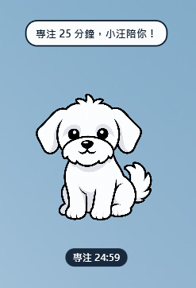

<p align="center">
  
</p>

<h1 align="center">Xiao Wang Desktop Pet</h1>

<p align="center">A lightweight, friendly Windows desktop companion built with PowerShell and WPF.</p>

<p align="center"><a href="README.zh-TW.md">繁體中文</a></p>

## Preview



## Features

- Transparent, always-on-top desktop pet window
- Drag, click, double-click, and right-click interactions
- Standing, waving, sitting, and sleeping character poses
- Gentle idle motion and optional automatic roaming
- System tray controls for visibility, size, walking speed, and topmost mode
- Click-through Do Not Disturb mode with `Ctrl+Alt+W`
- 25-minute focus timer with an automatic 5-minute break
- Water reminder every 30 minutes
- Time-aware greetings for morning, noon, afternoon, evening, and late night
- Runs fully offline with no external dependencies or telemetry

## Quick start

1. Download and extract the latest release ZIP.
2. Double-click `Start-XiaoWang.cmd`.
3. Right-click Xiao Wang or the tray icon to open the controls.

Windows PowerShell 5.1, WPF, and Windows Forms are included with supported Windows installations. No separate installation is required.

## Controls

| Action | Result |
| --- | --- |
| Click Xiao Wang | Wave and show a short message |
| Drag Xiao Wang | Move the pet around the desktop |
| Double-click Xiao Wang | Sleep or wake up |
| Right-click Xiao Wang | Open quick controls |
| `Ctrl+Alt+W` | Toggle click-through Do Not Disturb mode |
| Double-click tray icon | Show or hide Xiao Wang |

## Customization

The default display size is controlled near the top of `XiaoWangPet.ps1`:

```powershell
$petScale = 0.75
```

For example, use `0.60` for a smaller pet or `1.00` for the original size.

## Project structure

```text
xiaowang-desktop-pet/
├─ .github/workflows/validate.yml
├─ assets/
│  ├─ xiaowang.png
│  ├─ xiaowang-wave.png
│  ├─ xiaowang-sit.png
│  ├─ xiaowang-sleep.png
│  └─ xiaowang.ico
├─ XiaoWangPet.ps1
├─ Start-XiaoWang.cmd
├─ Start-XiaoWang.vbs
├─ README.md
├─ README.zh-TW.md
├─ ASSET_NOTICE.md
└─ LICENSE
```

## AI-assisted artwork disclosure

The character reference was supplied by the project author as an AI-generated image. The transparent cutout and animation poses were further generated or edited with AI image tools and curated for this project. No third-party celebrity or branded character artwork is intentionally included.

The MIT License applies to the software code only. See [ASSET_NOTICE.md](ASSET_NOTICE.md) for the image-asset notice.

## License

The software code is available under the [MIT License](LICENSE). Image assets are handled separately as described in [ASSET_NOTICE.md](ASSET_NOTICE.md).
